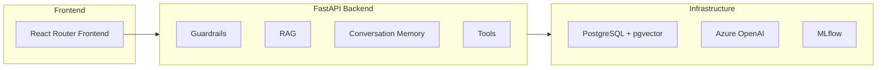
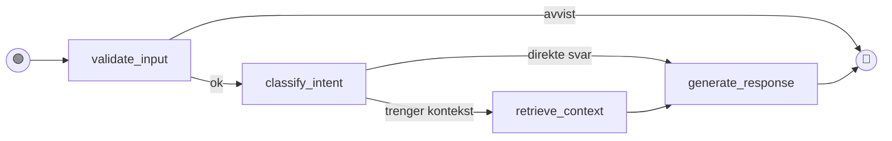
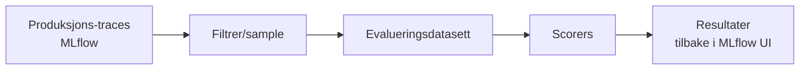
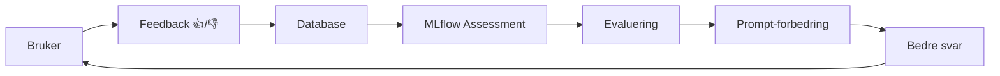

# Forutsigbar agentisk oppførsel med LangChain og MLflow

<div class="text-xl font-semibold text-white drop-shadow-lg">Magnus Rødseth og Håvard Opheim</div>

<div class="text-lg text-white/90 drop-shadow-md">Capra Consulting @ Gjensidige</div>

<div class="absolute inset-0 bg-black/75 -z-1"></div>

<div class="abs-br m-6 flex gap-8 items-center bg-white rounded-lg px-4 py-2">
  
  
</div>

<!--
Håvard: 

Velkommen! Vi er Magnus og Håvard fra Capra.
I dag skal vi vise hvordan vi bruker LangChain og MLflow for å bygge forutsigbare AI-agenter hos Gjensidige.

-->

---

# Hvem er vi?

<div class="flex gap-16 items-center justify-center mt-12">

<div class="flex flex-col items-center gap-4">
  
  <div class="text-center">
    <div class="font-bold text-lg">Magnus Rødseth</div>
    <div class="text-sm opacity-75">Utvikler i Capra Consulting</div>
  </div>
</div>

<div class="flex flex-col items-center gap-4">
  
  <div class="text-center">
    <div class="font-bold text-lg">Håvard Opheim</div>
    <div class="text-sm opacity-75">Utvikler i Capra Consulting</div>
  </div>
</div>

</div>

<div class="mt-12 text-center text-lg">

Utiled hos **Gjensidige**, hvor vi (blant annet) bygger agentiske AI-applikasjoner

</div>

<div class="abs-br m-6 flex gap-8 items-center bg-white rounded-lg px-4 py-2">
  
  
</div>

<!--
Håvard fortsetter
-->

---

# Dagens tema

**Forutsigbar agentisk oppførsel med LangChain og MLflow**

<div class="mt-8">

Agentiske applikasjoner kan oppleves som **uforutsigbare** og **vanskelig å forholde seg til** som utviklere.

Vi viser hvordan vi bruker **MLflow** og **LangChain** for å observere og guide adferden.

</div>

<div class="abs-br m-6 flex gap-8 items-center bg-white rounded-lg px-4 py-2">
  
  
</div>

<!--
Håvard: 
Temaet for denne presentasjonen er: Forutsigbar agentisk oppførsel med LangChain og MLflow.
Agentiske applikasjoner og store språkmodeller kan ofte oppleves som uforutsigbare og vanskelig å forholde seg til som utviklere.
Vi skal vise dere hvordan vi bruker MLflow og LangChain hos Gjensidige for å observere og guide adferden i agentiske applikasjoner.

Magnus:
Men først — en rask introduksjon til verktøyene vi bruker, for de som ikke har utvikleet agentiske applikasjoner.
-->

---
layout: section
class: text-center
---

## Lynkurs: LangChain, agenter og samtaledesign

<!--
Magnus
-->

---

# Hva er LangChain?

<div class="grid grid-cols-3 gap-4 mt-8">

<v-click>
<div class="border rounded p-4 text-center">
  <div class="text-4xl mb-2">📝</div>
  <div class="font-bold">Prompts</div>
  <div class="text-sm opacity-75">Prompt-maler</div>
</div>
</v-click>

<v-click>
<div class="border rounded p-4 text-center">
  <div class="text-4xl mb-2">🤖</div>
  <div class="font-bold">Modell</div>
  <div class="text-sm opacity-75">LLM-abstraksjoner</div>
</div>
</v-click>

<v-click>
<div class="border rounded p-4 text-center">
  <div class="text-4xl mb-2">✨</div>
  <div class="font-bold">Output</div>
  <div class="text-sm opacity-75">Strukturert respons</div>
</div>
</v-click>

</div>

<v-click>

<div class="mt-8">

**LangChain** er et Python-bibliotek som gjør det enklere å bygge applikasjoner med store språkmodeller.

I stedet for å skrive rå API-kall mot OpenAI, gir LangChain deg byggeblokker: prompt-maler, modellabstraksjoner, verktøy og minnehåndtering.

</div>

</v-click>

<v-click>

<div class="mt-4 p-4 bg-blue-500 bg-opacity-10 rounded">

**LangGraph** er et søsterbibliotek som lar deg bygge _agenter_.

</div>

</v-click>

<v-click>

<div class="mt-4 text-xl text-center opacity-75">

_Men hva er egentlig en agent?_

</div>

</v-click>

<!--
Magnus
-->

---

# Hva er en agent?

<div class="grid grid-cols-2 gap-8 mt-8">

<div>

## Vanlig LLM-integrasjon

```
Bruker → Spørsmål
   ↓
Modell → Svar
```

<div class="text-center mt-4 opacity-75">
Én runde. Ferdig.
</div>

</div>

<div>

## Agent

<v-clicks>

- 🧠 **Resonnere** over spørsmålet og planlegge neste steg
- 🛠️ **Bruke verktøy** — hente data, søke i dokumenter, kalle API-er
- 🔄 **Iterere** — sjekke svaret sitt, prøve på nytt
- 🤝 **Delegere** — sende deloppgaver til andre agenter

</v-clicks>

</div>

</div>

<v-click>

<div class="mt-8 p-4 bg-green-500 bg-opacity-10 rounded">

**I praksis:** Du gir en LLM tilgang til verktøy og lar den selv bestemme _om_ og _når_ den skal bruke dem.

</div>

</v-click>

<!--
Magnus
-->

---

# Tre nøkkelprinsipper for agentisk samtaledesign

<v-clicks>

<div class="mt-8">

## 1. Intensjonsklassifisering

Hva prøver brukeren å oppnå? Vi klassifiserer hvert spørsmål for å velge riktig behandling.

</div>

<div class="mt-8">

## 2. Kontekstinjeksjon

Vi henter relevant informasjon (fra dokumenter, databaser) og gir det til modellen _før_ den svarer.

</div>

<div class="mt-8">

## 3. Guardrails

Vi definerer hva agenten _ikke_ skal svare på. Holdningen er: **"Gjør én ting, gjør den bra."**

</div>

</v-clicks>

<!--
Håvard tar over. 
Nevn også at samtaler har en tre-struktur med noder og kanter hvor forskjellige verktøy og kontekst kan tilgjengeliggjøres i forskjellige noder
-->

---

# Hvordan koble på LangChain — i tre steg

````md magic-move
```python
# 1. Lag en modell
from langchain_openai import AzureChatOpenAI
model = AzureChatOpenAI(model="gpt-4.1")
```

```python
# 1. Lag en modell
from langchain_openai import AzureChatOpenAI
model = AzureChatOpenAI(model="gpt-4.1")

# 2. Lag en prompt
from langchain_core.prompts import ChatPromptTemplate
prompt = ChatPromptTemplate.from_messages([
    ("system", "Du er en hjelpsom assistent."),
    ("human", "{question}"),
])
```

```python
# 1. Lag en modell
from langchain_openai import AzureChatOpenAI
model = AzureChatOpenAI(model="gpt-4.1")

# 2. Lag en prompt
from langchain_core.prompts import ChatPromptTemplate
prompt = ChatPromptTemplate.from_messages([
    ("system", "Du er en hjelpsom assistent."),
    ("human", "{question}"),
])

# 3. Koble sammen og kjør
chain = prompt | model
response = chain.invoke({"question": "Hva er hovedpunktene?"})
```
````

<style>
.slidev-code-magic-move .shiki-magic-move-container {
  font-size: 0.9rem !important;
  line-height: 1.6 !important;
}
</style>

<!--
Håvard fortsetter: LangChain + en språkmodell enkelt å sette opp. Her er vårt oppsett med Azure Open AI og LangChain i Python. 
-->

---

# Hva bør man se etter og benchmarke?

<div class="grid grid-cols-3 gap-3 mt-6">

<v-click>
<div class="border rounded p-3">
  <div class="text-xl mb-1">⏱️</div>
  <div class="font-bold text-sm">Latency</div>
  <div class="text-xs opacity-75">Hvor lang tid tar hvert steg?</div>
</div>
</v-click>

<v-click>
<div class="border rounded p-3">
  <div class="text-xl mb-1">🎭</div>
  <div class="font-bold text-sm">Hallusinering</div>
  <div class="text-xs opacity-75">Finner modellen opp ting?</div>
</div>
</v-click>

<v-click>
<div class="border rounded p-3">
  <div class="text-xl mb-1">🛠️</div>
  <div class="font-bold text-sm">Verktøybruk</div>
  <div class="text-xs opacity-75">Valgte agenten riktig verktøy?</div>
</div>
</v-click>

<v-click>
<div class="border rounded p-3">
  <div class="text-xl mb-1">🎯</div>
  <div class="font-bold text-sm">Kontekstrelevans</div>
  <div class="text-xs opacity-75">Hentet RAG riktige dokumenter?</div>
</div>
</v-click>

<v-click>
<div class="border rounded p-3">
  <div class="text-xl mb-1">📉</div>
  <div class="font-bold text-sm">Regressjoner</div>
  <div class="text-xs opacity-75">Dårligere etter siste endring?</div>
</div>
</v-click>

</div>

<v-click>

<div class="mt-6 p-4 bg-purple-500 bg-opacity-10 rounded text-center">

**Dette er nøyaktig det vi skal vise dere hvordan vi måler — med MLflow.**

</div>

</v-click>

<!--
Når du bygger med agenter, er det noen ting du bør følge med på fra dag én:

- Latency — Hvor lang tid tar hvert steg? Agenter kan bli trege fordi de tar flere runder.
- Hallusinering — Finner modellen opp ting? Spesielt viktig når den svarer basert på brukerens dokumenter.
- Verktøybruk — Valgte agenten riktig verktøy? Kalte den det med riktige parametere?
- Kontekstrelevans — Hentet RAG-modulen de riktige dokumentene, eller bare de mest populære?
- Regressjoner — Ble svarkvaliteten dårligere etter siste prompt-endring?

Dette er nøyaktig det vi skal vise dere hvordan vi måler — med MLflow.
-->

---
layout: section
class: text-center
---

## Hva bygger vi?

<!--
Magnus intrduserer hva vi bygger
-->

---

# Caset: En agentisk dokumentassistent

<div class="grid grid-cols-2 gap-8">

<div>

<v-clicks>

Tenk deg at du bygger en chatbot der brukere kan:

- Laste opp komplekse dokumenter (rapporter, kontrakter, manualer)
- Stille spørsmål og få svar basert på innholdet
- Få AI-genererte oppsummeringer og anbefalinger

**Utfordringen:**
- Hvordan vet du at agenten fungerer?
- At den ikke hallusinerer?
- At RAG henter riktig kontekst?

</v-clicks>

</div>


</div>

<!--
Magnus.. 
-->

---

# Teknisk arkitektur — helt overordnet



<v-click>

**Tech-stacken:**
- Python, LangGraph + LangChain for agentorkestrering
- Azure OpenAI
- PostgreSQL med pgvector for data og RAG
- **MLflow for observabilitet**

</v-click>

<!--
Magnus
-->

---
layout: section
class: text-center
---

## Observabilitet og sporbarhet

<!--
Håvard: også over på hvordan vi følger med på adferden til agenten ut mot brukerne. Dette er en ganske kritisk del av innsikten vi samler for å vite om produktet skaper verdi eller ikke.
-->

---

# Hvorfor er observabilitet viktig?

Vi _må_ vite:

<v-clicks>

<div class="mt-8 grid grid-cols-3 gap-4">

<div class="border rounded p-4">
  <div class="text-3xl mb-2">👥</div>
  <div class="font-bold mb-2">Brukeratferd</div>
  <div class="text-sm">Hvordan bruker brukere AI-delene? Hva lurer de faktisk på?</div>
</div>

<div class="border rounded p-4">
  <div class="text-3xl mb-2">🤖</div>
  <div class="font-bold mb-2">Agentoppførsel</div>
  <div class="text-sm">Svarer den bra? Eller bare slop?</div>
</div>

<div class="border rounded p-4">
  <div class="text-3xl mb-2">📄</div>
  <div class="font-bold mb-2">Ekstraksjonskvalitet</div>
  <div class="text-sm">Finner AI-en all relevant informasjon</div>
</div>

</div>

</v-clicks>

<v-click>

<div class="mt-8 p-4 bg-yellow-500 bg-opacity-10 rounded">

**Vi bruker MLflow til å teste og iterere ettervhert som vi lærer mer om brukerne våre**

</div>

</v-click>

<!--
Spørsmål vi stiller oss:

1. Hvordan bruker folk AI-delene? Stiller de spørsmål vi ikke forventet? Treffer RAG-modulen riktig kontekst?
2. Hvordan oppfører agentene seg? Klassifiserer de intensjon riktig? Hallusinerer de?
3. Fungerer ekstraheringen? Finner AI-en alle relevante funn i dokumentene?
-->

---

# MLflow UI — Traces-oversikten


<!--
Hvis du spinner opp en docker image med MLflow så får du noe sånt som dette ut av boksen. Men du må confige bittelitt for å få data inn, men ikke så mye.
-->

---

# Slik setter vi opp MLflow-tracing

`init_mlflow()`:

````md magic-move
```python
# api/src/observability/tracing.py

import mlflow
from src.config import get_settings

def init_mlflow() -> None:
    """Initialize MLflow tracking."""
    settings = get_settings()
```

```python
# api/src/observability/tracing.py

import mlflow
from src.config import get_settings

def init_mlflow() -> None:
    """Initialize MLflow tracking."""
    settings = get_settings()

    # Sett tracking URI — peker på MLflow-serveren
    mlflow.set_tracking_uri(settings.mlflow_tracking_uri)

    # Sett eksperiment — alle traces havner her
    mlflow.set_experiment(settings.mlflow_experiment_name)
```

```python {16-17}
# api/src/observability/tracing.py

import mlflow
from src.config import get_settings

def init_mlflow() -> None:
    """Initialize MLflow tracking."""
    settings = get_settings()

    # Sett tracking URI — peker på MLflow-serveren
    mlflow.set_tracking_uri(settings.mlflow_tracking_uri)

    # Sett eksperiment — alle traces havner her
    mlflow.set_experiment(settings.mlflow_experiment_name)

    # Én linje — dette er magien
    mlflow.langchain.autolog(log_traces=True)
```
````

<!--
Alt begynner med én funksjon: init_mlflow(). Her er koden:

Først setter vi tracking URI — dette peker på MLflow-serveren.
Så setter vi eksperiment — alle traces havner her.

Og så kommer magien: mlflow.langchain.autolog(log_traces=True)

Den siste linjen er nøkkelen. Denne ene linjen gjør at alle LangChain- og LangGraph-kall automatisk blir tracet.
Hver node i grafen, hvert LLM-kall, hvert verktøykall — alt logges til MLflow uten at vi skriver en eneste dekoratør eller wrapper.

Denne funksjonen kalles når FastAPI-serveren starter opp, i main.py.
Vi kjører med 100% sampling i MVP-fasen — hvert eneste brukerbudskap blir tracet.
-->

---

# Hva tracer vi — og hva ser vi?

## Chat-agenten: En LangGraph-graf



<v-click>

Med `mlflow.langchain.autolog()` kan vi i MLflow UI se **hvert steg** som en span i tracet.

</v-click>

<!--
Chat-agenten vår er definert som en LangGraph StateGraph. Slik ser den ut:

Start → validate_input → classify_intent → retrieve_context (hvis nødvendig) → generate_response → End

Takket være mlflow.langchain.autolog() kan vi i MLflow UI se hvert steg som en span i tracet.
-->

---

# MLflow UI — Utvidet trace


<!--
Her ser dere et utvidet trace i MLflow UI — span-treet som viser:
- validate_input — Ble meldingen avvist av guardrails?
- classify_intent — Hva ble intensjonen?
- retrieve_context — Hvilke dokumentchunks ble hentet fra vektordatabasen?
- generate_response — Hva var den fulle prompten, og hva svarte LLM-en?

For hver span ser vi input, output, og latency. Uten å skrive en eneste linje observabilitetskode utover autolog().
-->

---

# Agenttilstanden — hva som flyter gjennom grafen

Tilstanden som flyter mellom nodene er definert som en TypedDict:

```python
# api/src/agent/state.py

class AgentState(TypedDict, total=False):
    messages: Annotated[list[BaseMessage], add_messages]
    conversation_id: uuid.UUID | None
    resolved_context: dict | None        # Bruker-/dokumentkontekst
    retrieved_docs: list[Document]       # RAG-resultater
    sources: list[dict]                  # Kildemetadata for siteringer
    current_step: str                    # Observabilitet
    intent: str | None                   # Klassifisert intensjon
    needs_retrieval: bool                # Trenger vi RAG?
    is_rejected: bool                    # Avvist av guardrails?
```

<v-click>

<div class="mt-4 p-4 bg-blue-500 bg-opacity-10 rounded">

Alt dette er synlig i hvert trace — vi kan se nøyaktig hva grafen "tenkte" i hvert steg.

</div>

</v-click>

<!--
Tilstanden som flyter mellom nodene er definert som en TypedDict.

Her ser dere alle feltene — messages, conversation_id, resolved_context, retrieved_docs, sources, current_step, intent, needs_retrieval, is_rejected.

Alt dette er synlig i hvert trace — vi kan se nøyaktig hva grafen "tenkte" i hvert steg.
-->

---

# Ekstraheringsagenten: Deep Agents med subagenter

<div class="text-sm">

For dokumentanalyse bruker vi **Deep Agents** — et abstraksjonslag over LangChain og LangGraph.

</div>

<v-click>

```python
from deepagents import create_deep_agent

def create_extraction_agent(...) -> Runnable:
    model = get_extraction_model()
    tools = [...]           # verktøy for parsing, lagring, fremdrift
    subagent = [...]        # subagent for ekstraksjon av strukturerte funn

    return create_deep_agent(
        model=model,
        tools=tools,
        subagents=subagent,
        system_prompt=ORCHESTRATOR_SYSTEM_PROMPT,
    )
```

</v-click>

<v-click>

<div class="mt-2 p-3 bg-purple-500 bg-opacity-10 rounded text-sm">

Fordi Deep Agents bygger på LangChain, får vi **automatisk tracing av hele orkestreringsagenten og alle subagent-kall** via den samme `autolog()`-linjen.

</div>

</v-click>

<!--
Magnus hopper inn igjen
-->

---

# MLflow UI — Ekstraheringsagent trace


<!--
Magnus fortsetter
-->

---

# Evaluering — Custom scorers

Tracing gir oss innsikt i _hva_ som skjer. Men vi trenger også å måle _hvor bra_ det fungerer.

Vi har bygget fire tilpassede scorers med **MLflow GenAI Evaluation**:

<v-clicks>

<div class="grid grid-cols-2 gap-4 mt-4">

<div class="border rounded p-3">
  <div class="text-xl mb-1">🎯</div>
  <div class="font-bold text-sm">GroundednessScorer</div>
  <div class="text-xs opacity-75">Er svaret forankret i konteksten? Fanger opp hallusinasjoner.</div>
</div>

<div class="border rounded p-3">
  <div class="text-xl mb-1">💡</div>
  <div class="font-bold text-sm">HelpfulnessScorer</div>
  <div class="text-xs opacity-75">Adresserer svaret brukerens spørsmål?</div>
</div>

<div class="border rounded p-3">
  <div class="text-xl mb-1">📚</div>
  <div class="font-bold text-sm">RetrievalRelevanceScorer</div>
  <div class="text-xs opacity-75">Er den hentede konteksten relevant for spørsmålet?</div>
</div>

<div class="border rounded p-3">
  <div class="text-xl mb-1">🇳🇴</div>
  <div class="font-bold text-sm">NorwegianLanguageScorer</div>
  <div class="text-xs opacity-75">Svarer agenten på norsk? (Viktig for oss!)</div>
</div>

</div>

</v-clicks>

<!--
Magnus
-->

---

# GroundednessScorer — Kodeeksempel

```python {*|4-6|7-8|10|12-16}{lines:true}
from mlflow.genai import scorer
from mlflow.entities import Feedback

def GroundednessScorer():
    @scorer
    def groundedness(*, inputs, outputs, context=None, **kwargs):
        if intent in ["REJECTED", "GENERAL_CHAT"]:
            return None                    # hopp over irrelevante intensjoner

        result = _groundedness_judge(...)  # LLM-dommer vurderer forankring

        return Feedback(
            value=...,      # 1.0 = forankret, 0.5 = delvis, 0.0 = hallusinert
            rationale=...,  # forklaring fra dommeren
        )
    return groundedness
```

<!--
Her er koden for GroundednessScorer.
-->

---

# Kjøre evalueringer — CLI

Vi har en CLI for å kjøre evalueringer mot utvalgte testdatasett eller produksjons-traces:

```bash
# Evaluer mot utvalgt testdatasett (17 testtilfeller)
uv run --directory api python -m src.evaluation.cli conversation
```

<v-click>

```bash
# Evaluer de siste 100 produksjons-tracene
uv run --directory api python -m src.evaluation.cli conversation \
    --from-traces --trace-count 100
```

</v-click>

<v-click>

```bash
# Evaluer med 20% sampling fra siste uke
uv run --directory api python -m src.evaluation.cli conversation \
    --from-traces --start-date 2026-01-01 --sample-rate 0.2
```

</v-click>

<!--
Magnus...
-->

---

# MLflow UI — Evaluation results


<!--
Resultatene havner i MLflow UI med:
- Aggregerte metrikker — pass rate, gjennomsnittsscore per scorer
- Individuelle testresultater med rationale
- Koblet til traces — du kan klikke deg ned i nøyaktig hva agenten gjorde
-->

---

# Utvalgte testdatasett

Vi har definert testtilfeller som dekker ulike scenarioer:

```python
# api/src/evaluation/datasets/conversation.py

DOCUMENT_TEST_CASES = [
    ConversationTestCase(
        id="doc_001",
        question="Hva er hovedfunnene i rapporten?",
        expected_intent="DOCUMENT_QUESTION",
        context="Rapport fra 2024. Tre kritiske funn identifisert.",
        reference_answer="Rapporten identifiserer tre kritiske funn.",
    ),
]

OUT_OF_SCOPE_TEST_CASES = [
    ConversationTestCase(
        id="oos_001",
        question="Kan du hjelpe meg med matlagning?",
        expected_intent="REJECTED",
    ),
]
```

<v-click>

<div class="mt-2 p-3 bg-blue-500 bg-opacity-10 rounded text-sm">

Disse testtilfellene kan kjøres som **regresjonstester** — etter hver endring i prompts eller agentkode kan vi verifisere at kvaliteten holder seg.

</div>

</v-click>

<!--
Magnus
-->

<style>
.slidev-code-wrapper {
  font-size: 0.52em !important;
}
</style>

---

# Produksjons-traces → Evaluering — Flyt



<!--
Magnus:
-->

---
layout: section
class: text-center
---

## Utvikling og hosting

<!--
Håvard tar resten
-->

---

# Lokal utvikling — Docker Compose

<div class="text-sm">

For lokal utvikling er MLflow del av vår Docker Compose:

</div>

```yaml {*|7-17}{lines:true}
# docker-compose.yml
services:
  postgres:
    image: pgvector/pgvector:pg16
    ports: ["5432:5432"]

  mlflow:
    build:
      dockerfile: docker/mlflow.Dockerfile
    command: >
      mlflow server
      --host 0.0.0.0 --port 5000
      --backend-store-uri postgresql://...@postgres:5432/mlflow
      --serve-artifacts
    ports: ["5000:5000"]
    depends_on:
      postgres: { condition: service_healthy }
```

<!--
For lokal utvikling er MLflow del av vår Docker Compose.

Vi har PostgreSQL med pgvector, MLflow som kjører som en egen container med PostgreSQL som backend-store, og Redis.

make db-up starter alt. http://localhost:5000 gir deg MLflow UI.
-->

---

# Produksjon — Hosting-alternativer

For produksjon kan MLflow hostes på flere måter.

<v-clicks>

<div class="mt-8">

**Databricks (vårt valg)**
- MLflow har native integrasjon med Databricks
- Skalerer automatisk
- Managed service — ingen infrastruktur å vedlikeholde

</div>

<div class="mt-8">

**Alternativer for produksjonsskala (fra MLflows dokumentasjon):**
- AWS SageMaker
- Azure Machine Learning
- Nebius
- GCP (GKE)

</div>

</v-clicks>

<!--
For produksjon kan MLflow hostes på flere måter.

Databricks er vårt valg fordi:
- MLflow har native integrasjon med Databricks
- Skalerer automatisk
- Managed service — ingen infrastruktur å vedlikeholde

Fra MLflows egen dokumentasjon — alternativer for produksjonsskala:
AWS SageMaker, Azure Machine Learning, Nebius, GCP.
-->

---
layout: section
class: text-center
---

## Oppsummering og veien videre

<!--
La oss oppsummere det vi har gått gjennom.
-->

---

# Den store idéen

<v-click>

<div class="text-2xl text-center mt-12 mb-12 p-8 bg-purple-500 bg-opacity-10 rounded">

Ved å dumpe all denne innsikten — hvert agentresonnement, hvert RAG-oppslag, hvert evalueringsresultat — inn i MLflow, kan vi gjøre **dataanalyse på bruker- og agentatferd**.

</div>

</v-click>

<v-click>

<div class="text-2xl text-center mt-12 p-8 bg-blue-500 bg-opacity-10 rounded">

Vi kan tweake systemet vårt, og skape en brukeropplevelse som brukerne faktisk _elsker_.

</div>

</v-click>

<!--
Poenget med alt dette er:

Ved å dumpe all denne innsikten — hvert agentresonnement, hvert RAG-oppslag, hvert evalueringsresultat — inn i MLflow, kan vi gjøre dataanalyse på bruker- og agentatferd.

Vi kan tweake systemet vårt, og skape en brukeropplevelse som brukerne faktisk elsker.
-->

---

# Feedback-loopen

<div class="border rounded-lg p-3 bg-gray-50 mt-2 text-left max-w-lg mx-auto">
  <div class="text-xs text-gray-500 mb-1">AI-assistent</div>
  <div class="text-sm text-gray-800 blur-sm">Basert på tilstandsrapporten din anbefaler jeg at du sjekker dreneringen rundt grunnmuren, spesielt...</div>
  <div class="flex gap-2 mt-2">
    <button class="px-2 py-1 rounded border text-xs bg-white">👍</button>
    <button class="px-2 py-1 rounded border text-xs bg-white">👎</button>
    <span class="text-xs text-gray-400 ml-2 mt-1">Var dette svaret nyttig?</span>
  </div>
</div>

<v-click>

<div class="text-sm mt-2">

Par dette med et **tilbakemeldingssystem** fra brukerne — og vi har en transparent måte å korrigere agentenes oppførsel i produksjon.

</div>

</v-click>

<v-click>



</v-click>

<!--
Par dette med et tilbakemeldingssystem fra brukerne — tommel opp/ned og kommentarer i chatten, eller flagging av at en ekstraksjon er helt feil — og vi har en transparent måte å korrigere agentenes oppførsel i produksjon.

Denne sirkelen — fra brukerinteraksjon til observabilitet til evaluering til forbedring — er det som gjør det mulig å skalere agentiske løsninger med selvtillit.
-->

---

# Oppsummert

<div class="text-sm">

| Hva                     | Hvordan                                    | Verktøy            |
| ----------------------- | ------------------------------------------ | ------------------ |
| Automatisk tracing      | `mlflow.langchain.autolog()`               | MLflow + LangChain |
| Agent-orkestrering      | LangGraph StateGraph                       | LangGraph          |
| Dokumentekstraksjon     | Deep Agents med subagenter                 | `deepagents`       |
| Kvalitetsmåling         | Custom scorers + `mlflow.genai.evaluate()` | MLflow GenAI       |
| Produksjonsmonitorering | Trace-basert evaluering med sampling       | MLflow traces API  |
| Bruker-feedback         | Thumbs up/down → MLflow assessments        | FastAPI + MLflow   |

</div>

<v-click>

<div class="mt-4 p-3 bg-green-500 bg-opacity-10 rounded text-center text-sm">

**Én linje kode gir oss full observabilitet.** Et sett med scorers gir oss systematisk kvalitetsmåling. Og muligheten til å evaluere produksjons-traces gir oss den tryggheten vi trenger for å skalere.

</div>

</v-click>

<!--
La meg oppsummere:

Automatisk tracing med mlflow.langchain.autolog() — MLflow + LangChain
Agent-orkestrering med LangGraph StateGraph — LangGraph
Dokumentekstraksjon med Deep Agents med subagenter — deepagents
Kvalitetsmåling med custom scorers og mlflow.genai.evaluate() — MLflow GenAI
Produksjonsmonitorering med trace-basert evaluering med sampling — MLflow traces API
Bruker-feedback med thumbs up/down til MLflow assessments — FastAPI + MLflow

Én linje kode gir oss full observabilitet.
Et sett med scorers gir oss systematisk kvalitetsmåling.
Og muligheten til å evaluere produksjons-traces gir oss den tryggheten vi trenger for å skalere.
-->

---
layout: center
class: text-center
---

# Takk for oppmerksomheten!

## Spørsmål?

<div class="mt-12">

**Magnus Rødseth og Håvard Opheim**

Capra Consulting @ Gjensidige

</div>

<div class="abs-br m-6 flex gap-8 items-center bg-white rounded-lg px-4 py-2">
  
  
</div>

<!--
Takk for oppmerksomheten! Spørsmål?
-->

