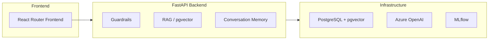

# Forutsigbar agentisk oppførsel med LangChain og MLflow

Magnus Rødseth og Håvard Opheim

Capra Consulting @ Gjensidige

<div class="abs-br m-6 flex gap-8 items-center bg-white rounded-lg px-4 py-2">
  
  
</div>

<!--
Velkommen! Vi er Magnus og Håvard fra Capra Consulting.
I dag skal vi vise hvordan vi bruker LangChain og MLflow for å bygge forutsigbare AI-agenter hos Gjensidige.
Presentasjonen varer 20 minutter.
-->

---
layout: two-cols
---

# Hvem er vi?

<v-clicks>

- **Magnus Rødseth** og **Håvard Opheim**
- Utviklere i Capra Consulting
- Jobber hos Gjensidige — Norges største forsikringsselskap
- Bygger AI-drevne løsninger for boligeiere

</v-clicks>

::right::

<v-click>

## Dagens tema

**Forutsigbar agentisk oppførsel med LangChain og MLflow**

<div class="mt-8">

Agentiske applikasjoner kan oppleves som **uforutsigbare** og **vanskelig å forholde seg til** som utviklere.

Vi viser hvordan vi bruker **MLflow** og **LangChain** for å observere og guide adferden.

</div>

</v-click>

<div class="abs-br m-6 flex gap-8 items-center bg-white rounded-lg px-4 py-2">
  
  
</div>

<!--
Hei alle sammen. Vi heter Magnus Rødseth og Håvard Opheim, og vi er utviklere i Capra Consulting.
Vi jobber for tiden på et nytt prosjekt hos Gjensidige — Norges største forsikringsselskap.

Temaet for denne presentasjonen er: Forutsigbar agentisk oppførsel med LangChain og MLflow.
Agentiske applikasjoner og store språkmodeller kan ofte oppleves som uforutsigbare og vanskelig å forholde seg til som utviklere.
Vi skal vise dere hvordan vi bruker MLflow og LangChain hos Gjensidige for å observere og guide adferden i agentiske applikasjoner.

Men først — en rask introduksjon til verktøyene vi bruker, for de som ikke har jobbet med dette før.
-->

---
layout: section
class: text-center
---

## Lynkurs: LangChain, agenter og samtaledesign

<!--
Før vi dykker inn i produktet, la oss sørge for at alle er på samme side.
-->

---

# Hva er LangChain?

<div class="grid grid-cols-3 gap-4 mt-8">

<v-click>
<div class="border rounded p-4 text-center">
  <div class="text-4xl mb-2">📝</div>
  <div class="font-bold">Prompts</div>
  <div class="text-sm opacity-75">Prompt-maler</div>
</div>
</v-click>

<v-click>
<div class="border rounded p-4 text-center">
  <div class="text-4xl mb-2">🤖</div>
  <div class="font-bold">Modell</div>
  <div class="text-sm opacity-75">LLM-abstraksjoner</div>
</div>
</v-click>

<v-click>
<div class="border rounded p-4 text-center">
  <div class="text-4xl mb-2">✨</div>
  <div class="font-bold">Output</div>
  <div class="text-sm opacity-75">Strukturert respons</div>
</div>
</v-click>

</div>

<v-click>

<div class="mt-8">

**LangChain** er et Python-bibliotek som gjør det enklere å bygge applikasjoner med store språkmodeller.

I stedet for å skrive rå API-kall mot OpenAI, gir LangChain deg byggeblokker: prompt-maler, modellabstraksjoner, verktøy og minnehåndtering.

</div>

</v-click>

<v-click>

<div class="mt-4 p-4 bg-blue-500 bg-opacity-10 rounded">

**LangGraph** er et søsterbibliotek som lar deg bygge _agenter_ — LLM-applikasjoner som kan ta flere steg, bruke verktøy, og ta avgjørelser underveis.

</div>

</v-click>

<!--
LangChain er et Python-bibliotek som gjør det enklere å bygge applikasjoner med store språkmodeller.
I stedet for å skrive rå API-kall mot OpenAI, gir LangChain deg byggeblokker: prompt-maler, modellabstraksjoner, verktøy og minnehåndtering.
Tenk på det som et rammeverk som lar deg sette sammen LLM-baserte pipelines uten å finne opp hjulet hver gang.

LangGraph er et søsterbibliotek som lar deg bygge agenter — altså LLM-applikasjoner som kan ta flere steg, bruke verktøy, og ta avgjørelser underveis.
Du definerer flyten som en graf med noder og kanter, og LangGraph håndterer tilstand, feilhåndtering og parallellitet.
-->

---

# Hva er en agent?

<div class="grid grid-cols-2 gap-8 mt-8">

<div>

## Vanlig LLM-integrasjon

```
Bruker → Spørsmål
   ↓
Modell → Svar
```

<div class="text-center mt-4 opacity-75">
Én runde. Ferdig.
</div>

</div>

<div>

## Agent

<v-clicks>

- 🧠 **Resonnere** over spørsmålet og planlegge neste steg
- 🛠️ **Bruke verktøy** — hente data, søke i dokumenter, kalle API-er
- 🔄 **Iterere** — sjekke svaret sitt, prøve på nytt
- 🤝 **Delegere** — sende deloppgaver til andre agenter

</v-clicks>

</div>

</div>

<v-click>

<div class="mt-8 p-4 bg-green-500 bg-opacity-10 rounded">

**I praksis:** Du gir en LLM tilgang til verktøy og lar den selv bestemme _om_ og _når_ den skal bruke dem.

</div>

</v-click>

<!--
En vanlig LLM-integrasjon er: bruker sender spørsmål → modell svarer. Én runde.

En agent er annerledes — den kan:
- Resonnere over spørsmålet og planlegge neste steg
- Bruke verktøy — hente data fra en database, søke i dokumenter, kalle API-er
- Iterere — sjekke svaret sitt, og prøve på nytt hvis det ikke er godt nok
- Delegere — sende deloppgaver til andre agenter

I praksis betyr det at du gir en LLM tilgang til verktøy og lar den selv bestemme om og når den skal bruke dem.
-->

---

# Tre nøkkelprinsipper for agentisk samtaledesign

<v-clicks>

<div class="mt-8">

## 1. Intensjonsklassifisering

Hva prøver brukeren å oppnå? Vi klassifiserer hvert spørsmål for å velge riktig behandling.

</div>

<div class="mt-8">

## 2. Kontekstinjeksjon

Vi henter relevant informasjon (fra dokumenter, databaser) og gir det til modellen _før_ den svarer.

</div>

<div class="mt-8">

## 3. Guardrails

Vi definerer hva agenten _ikke_ skal svare på. Holdningen er: **"Gjør én ting, gjør den bra."**

</div>

</v-clicks>

<!--
Når du designer samtaler for agenter, er det tre nøkkelprinsipper:

1. Intensjonsklassifisering — Hva prøver brukeren å oppnå? Vi klassifiserer hvert spørsmål for å velge riktig behandling.

2. Kontekstinjeksjon — Vi henter relevant informasjon fra dokumenter og databaser og gir det til modellen før den svarer.

3. Guardrails — Vi definerer hva agenten ikke skal svare på. Holdningen er: "Gjør én ting, gjør den bra."
-->

---

# Hvordan koble på LangChain — i tre steg

````md magic-move
```python
# 1. Lag en modell
from langchain_openai import AzureChatOpenAI
model = AzureChatOpenAI(model="gpt-4.1")
```

```python
# 1. Lag en modell
from langchain_openai import AzureChatOpenAI
model = AzureChatOpenAI(model="gpt-4.1")

# 2. Lag en prompt
from langchain_core.prompts import ChatPromptTemplate
prompt = ChatPromptTemplate.from_messages([
    ("system", "Du er en boligrådgiver."),
    ("human", "{question}"),
])
```

```python
# 1. Lag en modell
from langchain_openai import AzureChatOpenAI
model = AzureChatOpenAI(model="gpt-4.1")

# 2. Lag en prompt
from langchain_core.prompts import ChatPromptTemplate
prompt = ChatPromptTemplate.from_messages([
    ("system", "Du er en boligrådgiver."),
    ("human", "{question}"),
])

# 3. Koble sammen og kjør
chain = prompt | model
response = chain.invoke({"question": "Hva betyr TG2?"})
```
````

<!--
Det fine med LangChain er at terskelen er lav. I sin enkleste form:

1. Lag en modell — her bruker vi Azure OpenAI
2. Lag en prompt — en mal med system-melding og bruker-spørsmål
3. Koble sammen og kjør — bruk pipe-operatoren til å lage en chain

Tre linjer, og du har en fungerende LLM-pipeline.
Derfra bygger du på med verktøy, agentlogikk, RAG, og — som vi skal se — observabilitet.
-->

---

# Hva bør man se etter og benchmarke?

<div class="grid grid-cols-3 gap-3 mt-6">

<v-click>
<div class="border rounded p-3">
  <div class="text-xl mb-1">⏱️</div>
  <div class="font-bold text-sm">Latency</div>
  <div class="text-xs opacity-75">Hvor lang tid tar hvert steg?</div>
</div>
</v-click>

<v-click>
<div class="border rounded p-3">
  <div class="text-xl mb-1">🎭</div>
  <div class="font-bold text-sm">Hallusinering</div>
  <div class="text-xs opacity-75">Finner modellen opp ting?</div>
</div>
</v-click>

<v-click>
<div class="border rounded p-3">
  <div class="text-xl mb-1">🛠️</div>
  <div class="font-bold text-sm">Verktøybruk</div>
  <div class="text-xs opacity-75">Valgte agenten riktig verktøy?</div>
</div>
</v-click>

<v-click>
<div class="border rounded p-3">
  <div class="text-xl mb-1">🎯</div>
  <div class="font-bold text-sm">Kontekstrelevans</div>
  <div class="text-xs opacity-75">Hentet RAG riktige dokumenter?</div>
</div>
</v-click>

<v-click>
<div class="border rounded p-3">
  <div class="text-xl mb-1">📉</div>
  <div class="font-bold text-sm">Regressjoner</div>
  <div class="text-xs opacity-75">Dårligere etter siste endring?</div>
</div>
</v-click>

</div>

<v-click>

<div class="mt-6 p-4 bg-purple-500 bg-opacity-10 rounded text-center">

**Dette er nøyaktig det vi skal vise dere hvordan vi måler — med MLflow.**

</div>

</v-click>

<!--
Når du bygger med agenter, er det noen ting du bør følge med på fra dag én:

- Latency — Hvor lang tid tar hvert steg? Agenter kan bli trege fordi de tar flere runder.
- Hallusinering — Finner modellen opp ting? Spesielt viktig når den svarer basert på brukerens dokumenter.
- Verktøybruk — Valgte agenten riktig verktøy? Kalte den det med riktige parametere?
- Kontekstrelevans — Hentet RAG-modulen de riktige dokumentene, eller bare de mest populære?
- Regressjoner — Ble svarkvaliteten dårligere etter siste prompt-endring?

Dette er nøyaktig det vi skal vise dere hvordan vi måler — med MLflow.
-->

---
layout: section
class: text-center
---

## Hva bygger vi?

<!--
Nå som dere har en grunnleggende forståelse av LangChain og agenter, la oss se på hva vi faktisk bygger.
-->

---

# Hei, huset! — Snakk med boligen din

<div class="grid grid-cols-2 gap-8">

<div>

<v-clicks>

**Hei, huset!** — en AI-assistent som lar norske boligeiere "snakke med huset sitt".

Du har nettopp kjøpt en bolig:
- Tilstandsrapport på 40 sider
- Salgsoppgave
- FDV-dokumentasjon

**Løsningen:** Last opp dokumentene, og spør:
- "Hva er tilstanden på taket mitt?"
- "Hva bør jeg prioritere å fikse først?"

</v-clicks>

</div>

<div class="flex items-center justify-center">
  <div class="border-2 border-dashed border-yellow-400 rounded-lg p-6 text-yellow-400 text-center w-full h-56 flex flex-col items-center justify-center">
    <div class="text-3xl mb-2">💬🏠</div>
    <div class="text-sm font-bold">📸 PLACEHOLDER: App-screenshot</div>
    <div class="text-xs mt-2">Screenshot av Hei, huset!-appen (chat eller dashboard)</div>
    <div class="text-xs opacity-75 mt-1">Place as <code>/public/screenshots/hei-huset-app.png</code></div>
  </div>
</div>

</div>

<!--
Vi bygger Hei, huset! — en AI-assistent som lar norske boligeiere "snakke med huset sitt".

Tenk deg at du nettopp har kjøpt en bolig. Du har en tilstandsrapport på 40 sider, en salgsoppgave, kanskje FDV-dokumentasjon.
Alt dette er viktig informasjon om boligen din, men hvem leser egentlig 40 sider med fagspråk om tilstandsgrader og avvik?

Det er her Hei, huset! kommer inn. Du laster opp dokumentene dine, og så kan du bare spørre:
"Hva er tilstanden på taket mitt?" eller "Hva bør jeg prioritere å fikse først?"
-->

---

# Hva kan applikasjonen gjøre?

## 1. Chat med kontekst

<div class="border-2 border-dashed border-yellow-400 rounded-lg p-6 text-yellow-400 text-center mt-4 h-48 flex flex-col items-center justify-center">
  <div class="text-3xl mb-2">💬</div>
  <div class="text-sm font-bold">📸 PLACEHOLDER: Screenshot av chat-grensesnittet</div>
  <div class="text-xs mt-2">En samtale der brukeren spør om taket sitt og får et personalisert svar med kildehenvisninger</div>
  <div class="text-xs opacity-75 mt-1">Place as <code>/public/screenshots/chat-interface.png</code></div>
</div>

<v-clicks>

- Chatte med AI-en og stille spørsmål om boligen din
- AI-en bruker informasjon fra dokumentene dine og tilstandsvurderinger
- Du kan "tagge" kontekst — for eksempel en spesifikk tilstandsvurdering eller et varsel
- Personaliserte svar med kildehenvisninger

</v-clicks>

<!--
La meg ta dere gjennom de viktigste funksjonene.

Først: Chat med kontekst.
Du kan chatte med AI-en og stille spørsmål om boligen din.
AI-en bruker informasjon fra dokumentene dine og tilstandsvurderinger for å gi personaliserte svar.
Du kan "tagge" kontekst — for eksempel en spesifikk tilstandsvurdering eller et varsel — og AI-en tar hensyn til det i svaret.
-->

---

# 2. Dokumentanalyse med AI

<div class="border-2 border-dashed border-yellow-400 rounded-lg p-6 text-yellow-400 text-center mt-4 h-40 flex flex-col items-center justify-center">
  <div class="text-3xl mb-2">📊</div>
  <div class="text-sm font-bold">📸 PLACEHOLDER: Screenshot av property-siden</div>
  <div class="text-xs mt-2">Tilstandsvurderinger med TG-kort, fargekoder, ELI5-forklaringer, konfidensindikatorer</div>
  <div class="text-xs opacity-75 mt-1">Place as <code>/public/screenshots/property-conditions.png</code></div>
</div>

Når du laster opp en tilstandsrapport, kjører vi en ekstraheringsagent som:

<v-clicks>

- 📄 Leser og tolker hver side med vision-modell (PDF → Markdown)
- 🔍 Finner alle tilstandsvurderinger (TG0–TG3) med kategori, beskrivelse og anbefaling
- 📊 Vurderer påliteligheten på hvert funn — høy, middels eller lav
- 💡 Skriver en "explain like I'm 5"-forklaring for hvert punkt, uten faguttrykk
- ⭐ Prioriterer de 3–5 viktigste punktene du bør ta tak i

</v-clicks>

<!--
Funksjon nummer to: Dokumentanalyse med AI.

Når du laster opp en tilstandsrapport, kjører vi en ekstraheringsagent som:
- Leser og tolker hver side med vision-modell — PDF til Markdown
- Finner alle tilstandsvurderinger (TG0 til TG3) med kategori, beskrivelse og anbefaling
- Vurderer påliteligheten på hvert funn — høy, middels eller lav
- Skriver en "explain like I'm 5"-forklaring for hvert punkt, uten faguttrykk
- Prioriterer de 3 til 5 viktigste punktene du bør ta tak i
-->

---
layout: two-cols
---

# 3. Varsler

<div class="border-2 border-dashed border-yellow-400 rounded-lg p-4 text-yellow-400 text-center mt-4 h-32 flex flex-col items-center justify-center">
  <div class="text-2xl mb-1">⚠️</div>
  <div class="text-xs font-bold">📸 PLACEHOLDER: Varsler-siden</div>
  <div class="text-xs mt-1">Frostvarsel med personaliserte tiltak</div>
  <div class="text-xs opacity-75">→ <code>/public/screenshots/warnings.png</code></div>
</div>

<v-click>

Gjensidige sender varsler til boligeiere:
- Frost
- Kraftig nedbør
- Stormvarsel

Brukeren kan klikke på et varsel og få **personaliserte tiltak** for sin bolig.

</v-click>

::right::

# 4. Forbedringsplaner

<v-click>

<div class="border-2 border-dashed border-yellow-400 rounded-lg p-4 text-yellow-400 text-center mt-4 h-32 flex flex-col items-center justify-center">
  <div class="text-2xl mb-1">📋</div>
  <div class="text-xs font-bold">📸 PLACEHOLDER: Forbedringsplan</div>
  <div class="text-xs mt-1">Utbedringsplan med prioritering</div>
  <div class="text-xs opacity-75">→ <code>/public/screenshots/improvement-plan.png</code></div>
</div>

AI-en lager utbedringsplaner:
- For enkeltpunkter
- Samlet plan med prioritert rekkefølge
- Estimert kostnad og tidsbruk

</v-click>

<!--
Funksjon tre: Varsler.
Gjensidige sender varsler til boligeiere — frost, kraftig nedbør, stormvarsel.
Brukeren kan klikke på et varsel og få personaliserte tiltak for sin bolig.

Funksjon fire: Forbedringsplaner.
AI-en lager utbedringsplaner for enkeltpunkter eller en samlet plan med prioritert rekkefølge.
-->

---

# Teknisk arkitektur — helt overordnet



<v-click>

**Tech-stacken:**
- Python, LangGraph + LangChain for agentorkestrering
- Azure OpenAI (via Gjensidiges interne endpoint)
- PostgreSQL med pgvector for data og RAG
- **MLflow for observabilitet** ← Dette er fokuset i dag

</v-click>

<!--
Her er den tekniske arkitekturen på høyt nivå.

Vi har en React Router frontend med Gjensidige Builders design system.
FastAPI backend med guardrails for validering, RAG med pgvector, og conversation memory i PostgreSQL.
Infrastrukturen består av PostgreSQL med pgvector, Azure OpenAI via Gjensidiges interne endpoint, og MLflow for observabilitet.

Tech-stacken er: Python, LangGraph + LangChain for agentorkestrering, Azure OpenAI, PostgreSQL med pgvector, og — det vi skal fokusere på i dag — MLflow for observabilitet.
-->

---
layout: section
class: text-center
---

## Observabilitet og sporbarhet

<!--
Nå som dere forstår hva vi bygger, la oss snakke om hvorfor og hvordan vi legger til observabilitet.
Dette er kjernen av presentasjonen.
-->

---

# Hvorfor er observabilitet viktig?

Vi bygger en **MLS** — en "minimum lovable service" for pilotbrukerne våre.

Det betyr at vi _må_ vite:

<v-clicks>

<div class="mt-8 grid grid-cols-3 gap-4">

<div class="border rounded p-4">
  <div class="text-3xl mb-2">👥</div>
  <div class="font-bold mb-2">Brukeratferd</div>
  <div class="text-sm">Hvordan bruker folk AI-delene? Stiller de spørsmål vi ikke forventet?</div>
</div>

<div class="border rounded p-4">
  <div class="text-3xl mb-2">🤖</div>
  <div class="font-bold mb-2">Agentoppførsel</div>
  <div class="text-sm">Klassifiserer de intensjon riktig? Hallusinerer de?</div>
</div>

<div class="border rounded p-4">
  <div class="text-3xl mb-2">📄</div>
  <div class="font-bold mb-2">Ekstraksjonskvalitet</div>
  <div class="text-sm">Finner AI-en alle tilstandsvurderinger i dokumentene?</div>
</div>

</div>

</v-clicks>

<v-click>

<div class="mt-8 p-4 bg-yellow-500 bg-opacity-10 rounded">

**Personlig tenker jeg på observabilitet som en måte å introdusere _litt determinisme i det udeterministiske_ — eller i det minste litt klarhet der ting ikke alltid er like tydelig.**

</div>

</v-click>

<!--
Vi bygger en MLS — en "minimum lovable service" for pilotbrukerne våre. Det betyr at vi må vite:

1. Hvordan bruker folk AI-delene? Stiller de spørsmål vi ikke forventet? Treffer RAG-modulen riktig kontekst?
2. Hvordan oppfører agentene seg? Klassifiserer de intensjon riktig? Hallusinerer de?
3. Fungerer ekstraheringen? Finner AI-en alle tilstandsvurderinger i dokumentene?

Personlig tenker jeg på observabilitet som en måte å introdusere litt determinisme i det udeterministiske — eller i det minste litt klarhet der ting ikke alltid er like tydelig.
-->

---

# MLflow UI — Traces-oversikten

<div class="border-2 border-dashed border-yellow-400 rounded-lg p-8 text-yellow-400 text-center mt-8 h-80 flex flex-col items-center justify-center">
  <div class="text-4xl mb-4">📊</div>
  <div class="text-sm font-bold">📸 PLACEHOLDER: MLflow UI — Traces-oversikten</div>
  <div class="text-xs mt-2">En liste med traces, med kolonner for trace ID, status, latency, og tidspunkt</div>
  <div class="text-xs opacity-75 mt-1">Place as <code>/public/screenshots/mlflow-traces-overview.png</code></div>
</div>

<!--
Her ser dere MLflow UI — traces-oversikten.
Dette er en liste med alle traces, med kolonner for trace ID, status, latency, og tidspunkt.
-->

---

# Slik setter vi opp MLflow-tracing

Alt begynner med én funksjon: `init_mlflow()`

````md magic-move
```python
# api/src/observability/tracing.py

import mlflow
from src.config import get_settings

def init_mlflow() -> None:
    """Initialize MLflow tracking."""
    settings = get_settings()
```

```python
# api/src/observability/tracing.py

import mlflow
from src.config import get_settings

def init_mlflow() -> None:
    """Initialize MLflow tracking."""
    settings = get_settings()

    # Sett tracking URI — peker på MLflow-serveren
    mlflow.set_tracking_uri(settings.mlflow_tracking_uri)

    # Sett eksperiment — alle traces havner her
    mlflow.set_experiment(settings.mlflow_experiment_name)
```

```python {16-17}
# api/src/observability/tracing.py

import mlflow
from src.config import get_settings

def init_mlflow() -> None:
    """Initialize MLflow tracking."""
    settings = get_settings()

    # Sett tracking URI — peker på MLflow-serveren
    mlflow.set_tracking_uri(settings.mlflow_tracking_uri)

    # Sett eksperiment — alle traces havner her
    mlflow.set_experiment(settings.mlflow_experiment_name)

    # Én linje — dette er magien
    mlflow.langchain.autolog(log_traces=True)
```
````

<!--
Alt begynner med én funksjon: init_mlflow(). Her er koden:

Først setter vi tracking URI — dette peker på MLflow-serveren.
Så setter vi eksperiment — alle traces havner her.

Og så kommer magien: mlflow.langchain.autolog(log_traces=True)

Den siste linjen er nøkkelen. Denne ene linjen gjør at alle LangChain- og LangGraph-kall automatisk blir tracet.
Hver node i grafen, hvert LLM-kall, hvert verktøykall — alt logges til MLflow uten at vi skriver en eneste dekoratør eller wrapper.

Denne funksjonen kalles når FastAPI-serveren starter opp, i main.py.
Vi kjører med 100% sampling i MVP-fasen — hvert eneste brukerbudskap blir tracet.
-->

---

# Hva tracer vi — og hva ser vi?

## Chat-agenten: En LangGraph-graf

```mermaid {scale: 0.6}
graph LR
    Start(("🟢")) --> validate_input
    validate_input -->|avvist| End(("🔴"))
    validate_input -->|ok| classify_intent
    classify_intent -->|trenger kontekst| retrieve_context
    classify_intent -->|direkte svar| generate_response
    retrieve_context --> generate_response
    generate_response --> End
```



<v-click>

Takket være `mlflow.langchain.autolog()` kan vi i MLflow UI se **hvert steg** som en span i tracet.

</v-click>

<!--
Chat-agenten vår er definert som en LangGraph StateGraph. Slik ser den ut:

Start → validate_input → classify_intent → retrieve_context (hvis nødvendig) → generate_response → End

Takket være mlflow.langchain.autolog() kan vi i MLflow UI se hvert steg som en span i tracet.
-->

---

# MLflow UI — Utvidet trace

<div class="border-2 border-dashed border-yellow-400 rounded-lg p-8 text-yellow-400 text-center mt-8 h-80 flex flex-col items-center justify-center">
  <div class="text-4xl mb-4">🔍</div>
  <div class="text-sm font-bold">📸 PLACEHOLDER: MLflow UI — Utvidet trace</div>
  <div class="text-xs mt-2">Span-treet med validate_input → classify_intent → retrieve_context → generate_response</div>
  <div class="text-xs mt-1">med input/output for hver span og latency-bar</div>
  <div class="text-xs opacity-75 mt-1">Place as <code>/public/screenshots/mlflow-trace-expanded.png</code></div>
</div>

<!--
Her ser dere et utvidet trace i MLflow UI — span-treet som viser:
- validate_input — Ble meldingen avvist av guardrails?
- classify_intent — Hva ble intensjonen?
- retrieve_context — Hvilke dokumentchunks ble hentet fra vektordatabasen?
- generate_response — Hva var den fulle prompten, og hva svarte LLM-en?

For hver span ser vi input, output, og latency. Uten å skrive en eneste linje observabilitetskode utover autolog().
-->

---

# Agenttilstanden — hva som flyter gjennom grafen

Tilstanden som flyter mellom nodene er definert som en TypedDict:

```python
# api/src/agent/state.py

class AgentState(TypedDict, total=False):
    messages: Annotated[list[BaseMessage], add_messages]
    conversation_id: uuid.UUID | None
    resolved_context: dict | None        # Eiendoms-/tilstandskontekst
    retrieved_docs: list[Document]       # RAG-resultater
    sources: list[dict]                  # Kildemetadata for siteringer
    current_step: str                    # Observabilitet
    intent: str | None                   # Klassifisert intensjon
    needs_retrieval: bool                # Trenger vi RAG?
    is_rejected: bool                    # Avvist av guardrails?
```

<v-click>

<div class="mt-4 p-4 bg-blue-500 bg-opacity-10 rounded">

Alt dette er synlig i hvert trace — vi kan se nøyaktig hva grafen "tenkte" i hvert steg.

</div>

</v-click>

<!--
Tilstanden som flyter mellom nodene er definert som en TypedDict.

Her ser dere alle feltene — messages, conversation_id, resolved_context, retrieved_docs, sources, current_step, intent, needs_retrieval, is_rejected.

Alt dette er synlig i hvert trace — vi kan se nøyaktig hva grafen "tenkte" i hvert steg.
-->

---

# Ekstraheringsagenten: Deep Agents med subagenter

<div class="text-sm">

For dokumentanalyse bruker vi **Deep Agents** — et abstraksjonslag over LangChain og LangGraph.

</div>

<v-click>

```python
from deepagents import create_deep_agent

def create_extraction_agent(...) -> Runnable:
    model = get_extraction_model()
    tools = [...]           # verktøy for parsing, lagring, fremdrift
    subagent = [...]        # subagent for ekstraksjon av tilstandsvurderinger

    return create_deep_agent(
        model=model,
        tools=tools,
        subagents=subagent,
        system_prompt=ORCHESTRATOR_SYSTEM_PROMPT,
    )
```

</v-click>

<v-click>

<div class="mt-2 p-3 bg-purple-500 bg-opacity-10 rounded text-sm">

Fordi Deep Agents bygger på LangChain, får vi **automatisk tracing av hele orkestreringsagenten og alle subagent-kall** via den samme `autolog()`-linjen.

</div>

</v-click>

<!--
For dokumentanalyse bruker vi Deep Agents-biblioteket — et bibliotek for å bygge agenter med planlegging, subagenter og verktøy, bygget av LangChain-teamet.
Tenk på det som et abstraksjonslag over LangChain og LangGraph for å få kjernen av Claude Code out-of-the-box uten å måtte skrive all kode selv.

Fordi Deep Agents bygger på LangChain, får vi automatisk tracing av hele orkestreringsagenten og alle subagent-kall via den samme autolog()-linjen.
-->

---

# MLflow UI — Ekstraheringsagent trace

<div class="border-2 border-dashed border-yellow-400 rounded-lg p-8 text-yellow-400 text-center mt-8 h-80 flex flex-col items-center justify-center">
  <div class="text-4xl mb-4">🌳</div>
  <div class="text-sm font-bold">📸 PLACEHOLDER: MLflow UI — Ekstraheringsagent trace</div>
  <div class="text-xs mt-2">Dypt span-tre med orkestrator-agenten øverst, condition-extractor-subagenten nøstet under,</div>
  <div class="text-xs">og individuelle LLM-kall med tool calls synlige</div>
  <div class="text-xs opacity-75 mt-1">Place as <code>/public/screenshots/mlflow-extraction-trace.png</code></div>
</div>

<!--
Her ser dere et ekstraheringsagent-trace i MLflow UI — det dype span-treet med orkestrator-agenten øverst, condition-extractor-subagenten nøstet under, og individuelle LLM-kall med tool calls synlige.

I MLflow UI kan vi se:
- Hovedagentens resonnering og verktøykall
- Subagentens ekstraheringsresultater
- Hvert LLM-kall med full prompt og respons
- Tidsbruk per fase
-->

---

# Evaluering — Custom scorers

Tracing gir oss innsikt i _hva_ som skjer. Men vi trenger også å måle _hvor bra_ det fungerer.

Vi har bygget fire tilpassede scorers med **MLflow GenAI Evaluation**:

<v-clicks>

<div class="grid grid-cols-2 gap-4 mt-4">

<div class="border rounded p-3">
  <div class="text-xl mb-1">🎯</div>
  <div class="font-bold text-sm">GroundednessScorer</div>
  <div class="text-xs opacity-75">Er svaret forankret i konteksten? Fanger opp hallusinasjoner.</div>
</div>

<div class="border rounded p-3">
  <div class="text-xl mb-1">💡</div>
  <div class="font-bold text-sm">HelpfulnessScorer</div>
  <div class="text-xs opacity-75">Adresserer svaret brukerens spørsmål?</div>
</div>

<div class="border rounded p-3">
  <div class="text-xl mb-1">📚</div>
  <div class="font-bold text-sm">RetrievalRelevanceScorer</div>
  <div class="text-xs opacity-75">Er den hentede konteksten relevant for spørsmålet?</div>
</div>

<div class="border rounded p-3">
  <div class="text-xl mb-1">🇳🇴</div>
  <div class="font-bold text-sm">NorwegianLanguageScorer</div>
  <div class="text-xs opacity-75">Svarer agenten på norsk? (Viktig for oss!)</div>
</div>

</div>

</v-clicks>

<!--
Tracing gir oss innsikt i hva som skjer.
Men vi trenger også å måle hvor bra det fungerer.

Her bruker vi MLflow GenAI Evaluation.

Vi har bygget fire tilpassede scorers:

1. GroundednessScorer — Er svaret forankret i konteksten? Fanger opp hallusinasjoner.
2. HelpfulnessScorer — Adresserer svaret brukerens spørsmål? En høflig avvisning av off-topic-spørsmål regnes som "helpful".
3. RetrievalRelevanceScorer — Er den hentede konteksten relevant for spørsmålet?
4. NorwegianLanguageScorer — Svarer agenten på norsk? Viktig for oss!
-->

---

# GroundednessScorer — Kodeeksempel

```python {*|4-6|7-8|10|12-16}{lines:true}
from mlflow.genai import scorer
from mlflow.entities import Feedback

def GroundednessScorer():
    @scorer
    def groundedness(*, inputs, outputs, context=None, **kwargs):
        if intent in ["REJECTED", "GENERAL_CHAT"]:
            return None                    # hopp over irrelevante intensjoner

        result = _groundedness_judge(...)  # LLM-dommer vurderer forankring

        return Feedback(
            value=...,      # 1.0 = forankret, 0.5 = delvis, 0.0 = hallusinert
            rationale=...,  # forklaring fra dommeren
        )
    return groundedness
```

<!--
Her er koden for GroundednessScorer.

Vi bruker @scorer-dekoratøren fra MLflow.
Først hopper vi over evaluering for REJECTED og GENERAL_CHAT-intensjoner — det gir ikke mening å evaluere forankring for "Hei, hvordan har du det?".
Så kaller vi en strukturert output-dommer som vurderer om svaret er forankret i konteksten.
Vi mapper resultatet til en score: 1.0 for fully grounded, 0.5 for partially grounded, 0.0 for hallucinated.
Og vi returnerer Feedback med score og rationale.

Legg merke til at scorerne er intensjonsbevisste. Hvis intensjonen er GENERAL_CHAT, hopper vi over groundedness-evalueringen.
-->

---

# Kjøre evalueringer — CLI

Vi har en CLI for å kjøre evalueringer mot utvalgte testdatasett eller produksjons-traces:

```bash
# Evaluer mot utvalgt testdatasett (17 testtilfeller)
uv run --directory api python -m src.evaluation.cli conversation
```

<v-click>

```bash
# Evaluer de siste 100 produksjons-tracene
uv run --directory api python -m src.evaluation.cli conversation \
    --from-traces --trace-count 100
```

</v-click>

<v-click>

```bash
# Evaluer med 20% sampling fra siste uke
uv run --directory api python -m src.evaluation.cli conversation \
    --from-traces --start-date 2026-01-01 --sample-rate 0.2
```

</v-click>

<!--
Vi har en CLI for å kjøre evalueringer.

Første kommando: Evaluer mot utvalgt testdatasett med 17 testtilfeller.
Andre kommando: Evaluer de siste 100 produksjons-tracene.
Tredje kommando: Evaluer med 20% sampling fra siste uke.
-->

---

# MLflow UI — Evaluation results

<div class="border-2 border-dashed border-yellow-400 rounded-lg p-8 text-yellow-400 text-center mt-8 h-80 flex flex-col items-center justify-center">
  <div class="text-4xl mb-4">📈</div>
  <div class="text-sm font-bold">📸 PLACEHOLDER: MLflow UI — Evaluation results</div>
  <div class="text-xs mt-2">Tabell med aggregerte metrikker (pass rate, gjennomsnittsscore per scorer)</div>
  <div class="text-xs">og rader med individuelle testtilfeller som viser score + rationale</div>
  <div class="text-xs opacity-75 mt-1">Place as <code>/public/screenshots/mlflow-evaluation-results.png</code></div>
</div>

<!--
Resultatene havner i MLflow UI med:
- Aggregerte metrikker — pass rate, gjennomsnittsscore per scorer
- Individuelle testresultater med rationale
- Koblet til traces — du kan klikke deg ned i nøyaktig hva agenten gjorde
-->

---

# Utvalgte testdatasett

Vi har definert testtilfeller som dekker ulike scenarioer:

```python
# api/src/evaluation/datasets/conversation.py

PROPERTY_TEST_CASES = [
    ConversationTestCase(
        id="prop_001",
        question="Hvor gammelt er taket mitt?",
        expected_intent="PROPERTY_QUESTION",
        context="Byggeår: 1985. Taket ble lagt om i 2010.",
        reference_answer="Taket ble lagt om i 2010, ca. 15 år gammelt.",
    ),
]

OUT_OF_SCOPE_TEST_CASES = [
    ConversationTestCase(
        id="oos_001",
        question="Kan du hjelpe meg med matlagning?",
        expected_intent="REJECTED",
    ),
]
```

<v-click>

<div class="mt-2 p-3 bg-blue-500 bg-opacity-10 rounded text-sm">

Disse testtilfellene kan kjøres som **regresjonstester** — etter hver endring i prompts eller agentkode kan vi verifisere at kvaliteten holder seg.

</div>

</v-click>

<!--
Vi har definert testtilfeller som dekker ulike scenarioer.

Her er et eksempel på en PROPERTY_TEST_CASE — "Hvor gammelt er taket mitt?" med forventet intensjon og referansesvar.
Og et eksempel på en OUT_OF_SCOPE_TEST_CASE — "Kan du hjelpe meg med matlagning?" som skal avvises.

Disse testtilfellene kan kjøres som regresjonstester — etter hver endring i prompts eller agentkode kan vi verifisere at kvaliteten holder seg.
-->

---

# Produksjons-traces → Evaluering

<div class="text-sm">

Det virkelig kraftige er at vi kan ta _ekte_ brukerinteraksjoner fra produksjon og evaluere dem:

</div>

```python {*|1-10|12-20}{lines:true}
# api/src/evaluation/datasets/traces.py

def query_mlflow_traces(experiment_name, trace_count, start_date):
    """Hent traces fra MLflow for evaluering."""
    client = mlflow.MlflowClient()
    return client.search_traces(
        experiment_ids=[experiment.experiment_id],
        max_results=trace_count,
        order_by=["timestamp_ms DESC"],
    )

def convert_traces_to_dataset(traces):
    """Konverter MLflow-traces til evalueringsdatasett."""
    dataset = []
    for trace in traces:
        dataset.append({
            "inputs": {"question": question},
            "outputs": {"answer": answer, "context": context, "intent": intent},
        })
    return dataset
```

<!--
Det virkelig kraftige er at vi kan ta ekte brukerinteraksjoner fra produksjon og evaluere dem.

Vi har en funksjon som henter traces fra MLflow for evaluering.
Og en funksjon som konverterer MLflow-traces til evalueringsdatasett.

Vi ekstraher spørsmål, svar, kontekst og intensjon fra tracens request/response data.
-->

---

# Produksjons-traces → Evaluering — Flyt


<!--
Flyten er: Produksjon → MLflow traces → Filtrer/sample → Evalueringsdatasett → Scorers → Resultater tilbake i MLflow UI.

Dette gir oss muligheten til å kontinuerlig evaluere kvaliteten på produksjons-interaksjoner.
-->

---
layout: section
class: text-center
---

## Utvikling og hosting

<!--
La oss se på hvordan vi kjører dette lokalt og i produksjon.
-->

---

# Lokal utvikling — Docker Compose

<div class="text-sm">

For lokal utvikling er MLflow del av vår Docker Compose:

</div>

```yaml {*|7-17}{lines:true}
# docker-compose.yml
services:
  postgres:
    image: pgvector/pgvector:pg16
    ports: ["5432:5432"]

  mlflow:
    build:
      dockerfile: docker/mlflow.Dockerfile
    command: >
      mlflow server
      --host 0.0.0.0 --port 5000
      --backend-store-uri postgresql://...@postgres:5432/mlflow
      --serve-artifacts
    ports: ["5000:5000"]
    depends_on:
      postgres: { condition: service_healthy }
```

<!--
For lokal utvikling er MLflow del av vår Docker Compose.

Vi har PostgreSQL med pgvector, MLflow som kjører som en egen container med PostgreSQL som backend-store, og Redis.

make db-up starter alt. http://localhost:5000 gir deg MLflow UI.
-->

---

# Produksjon — Databricks

For produksjon vil vi hoste MLflow i **Databricks** innenfor Gjensidige sin skyrigg på Azure.

<v-clicks>

<div class="mt-8">

**Hvorfor Databricks?**
- MLflow har native integrasjon med Databricks
- Gjensidige bruker allerede Databricks for dataplattformen sin
- Skalerer automatisk
- Managed service — ingen infrastruktur å vedlikeholde

</div>

<div class="mt-8">

**Alternativer for produksjonsskala (fra MLflows dokumentasjon):**
- AWS SageMaker
- Azure Machine Learning
- Nebius
- GCP (GKE)

</div>

</v-clicks>

<!--
For produksjon vil vi hoste MLflow i Databricks innenfor Gjensidige sin skyrigg på Azure.

Hvorfor Databricks?
- MLflow har native integrasjon med Databricks
- Gjensidige bruker allerede Databricks for dataplattformen sin
- Skalerer automatisk
- Managed service — ingen infrastruktur å vedlikeholde

Fra MLflows egen dokumentasjon — alternativer for produksjonsskala:
AWS SageMaker, Azure Machine Learning, Nebius, GCP.
Vi bruker Databricks.
-->

---
layout: section
class: text-center
---

## Oppsummering og veien videre

<!--
La oss oppsummere det vi har gått gjennom.
-->

---

# Den store idéen

<v-click>

<div class="text-2xl text-center mt-12 mb-12 p-8 bg-purple-500 bg-opacity-10 rounded">

Ved å dumpe all denne innsikten — hvert agentresonnement, hvert RAG-oppslag, hvert evalueringsresultat — inn i MLflow, kan vi gjøre **dataanalyse på bruker- og agentatferd**.

</div>

</v-click>

<v-click>

<div class="text-2xl text-center mt-12 p-8 bg-blue-500 bg-opacity-10 rounded">

Vi kan tweake systemet vårt, og skape en brukeropplevelse som brukerne faktisk _elsker_.

</div>

</v-click>

<!--
Poenget med alt dette er:

Ved å dumpe all denne innsikten — hvert agentresonnement, hvert RAG-oppslag, hvert evalueringsresultat — inn i MLflow, kan vi gjøre dataanalyse på bruker- og agentatferd.

Vi kan tweake systemet vårt, og skape en brukeropplevelse som brukerne faktisk elsker.
-->

---

# Feedback-loopen

<div class="border-2 border-dashed border-yellow-400 rounded-lg p-3 text-yellow-400 text-center mt-2 h-28 flex flex-col items-center justify-center">
  <div class="text-2xl mb-1">👍👎</div>
  <div class="text-xs font-bold">📸 PLACEHOLDER: Chat UI med feedback-knapper</div>
  <div class="text-xs mt-1">Tommel opp/ned-knapper under et AI-svar</div>
  <div class="text-xs opacity-75">→ <code>/public/screenshots/chat-feedback-ui.png</code></div>
</div>

<v-click>

<div class="text-sm mt-2">

Par dette med et **tilbakemeldingssystem** fra brukerne — og vi har en transparent måte å korrigere agentenes oppførsel i produksjon.

```mermaid {scale: 0.55}
graph LR
    A[Bruker] --> B[Feedback 👍/👎]
    B --> C[Database]
    C --> D[MLflow Assessment]
    D --> E[Evaluering]
    E --> F[Prompt-forbedring]
    F --> G[Bedre svar]
    G --> A
```

</div>

</v-click>

<v-click>



</v-click>

<!--
Par dette med et tilbakemeldingssystem fra brukerne — tommel opp/ned og kommentarer i chatten, eller flagging av at en ekstraksjon er helt feil — og vi har en transparent måte å korrigere agentenes oppførsel i produksjon.

Denne sirkelen — fra brukerinteraksjon til observabilitet til evaluering til forbedring — er det som gjør det mulig å skalere agentiske løsninger med selvtillit.
-->

---

# Oppsummert

<div class="text-sm">

| Hva                     | Hvordan                                    | Verktøy            |
| ----------------------- | ------------------------------------------ | ------------------ |
| Automatisk tracing      | `mlflow.langchain.autolog()`               | MLflow + LangChain |
| Agent-orkestrering      | LangGraph StateGraph                       | LangGraph          |
| Dokumentekstraksjon     | Deep Agents med subagenter                 | `deepagents`       |
| Kvalitetsmåling         | Custom scorers + `mlflow.genai.evaluate()` | MLflow GenAI       |
| Produksjonsmonitorering | Trace-basert evaluering med sampling       | MLflow traces API  |
| Bruker-feedback         | Thumbs up/down → MLflow assessments        | FastAPI + MLflow   |

</div>

<v-click>

<div class="mt-4 p-3 bg-green-500 bg-opacity-10 rounded text-center text-sm">

**Én linje kode gir oss full observabilitet.** Et sett med scorers gir oss systematisk kvalitetsmåling. Og muligheten til å evaluere produksjons-traces gir oss den tryggheten vi trenger for å skalere.

</div>

</v-click>

<!--
La meg oppsummere:

Automatisk tracing med mlflow.langchain.autolog() — MLflow + LangChain
Agent-orkestrering med LangGraph StateGraph — LangGraph
Dokumentekstraksjon med Deep Agents med subagenter — deepagents
Kvalitetsmåling med custom scorers og mlflow.genai.evaluate() — MLflow GenAI
Produksjonsmonitorering med trace-basert evaluering med sampling — MLflow traces API
Bruker-feedback med thumbs up/down til MLflow assessments — FastAPI + MLflow

Én linje kode gir oss full observabilitet.
Et sett med scorers gir oss systematisk kvalitetsmåling.
Og muligheten til å evaluere produksjons-traces gir oss den tryggheten vi trenger for å skalere.
-->

---
layout: center
class: text-center
---

# Takk for oppmerksomheten!

## Spørsmål?

<div class="mt-12">

**Magnus Rødseth og Håvard Opheim**

Capra Consulting @ Gjensidige

</div>

<div class="abs-br m-6 flex gap-8 items-center bg-white rounded-lg px-4 py-2">
  
  
</div>

<!--
Takk for oppmerksomheten! Spørsmål?
-->
